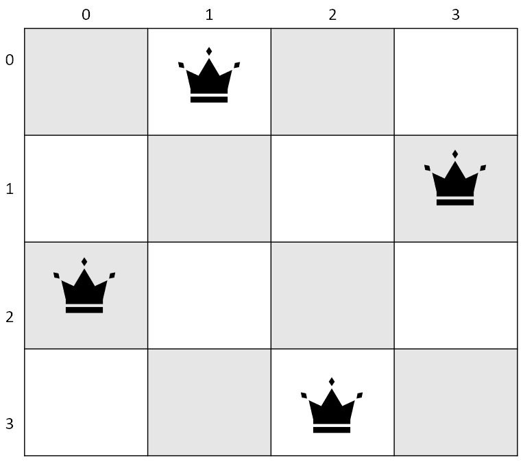

# N Queens Problem
## Introduction

The n queens problem (also known as 8 queens) is a classic chess puzzle that consists of placing a given number of queen pieces (*n*) in a chessboard of *n x n* dimensions in such a way that none of them are "threatened" by one another.

Generally, it is accepted that there are solutions for all natural numbers (except for *n = 2* & *n = 3*) as can be seen in the following table:

*n*|unique|total
:-:|-:|-:
1|1|1
2|0|0
3|0|0
4|1|2
5|2|10
6|1|4
7|6|40
8|12|92
9|46|352
10|92|724
11|341|2,680
12|1,787|14,200
13|9,233|73,712
14|45,752|365,596
15|285,053|2,279,184
16|1,846,955|14,772,512
17|11,977,939|95,815,104
18|83,263,591|666,090,624
19|621,012,754|4,968,057,848
20|4,878,666,808|39,029,188,884
21|39,333,324,973|314,666,222,712
22|336,376,244,042|2,691,008,701,644
23|3,029,242,658,210|24,233,937,684,440
24|28,439,272,956,934|227,514,171,973,736
25|275,986,683,743,434|2,207,893,435,808,352
26|2,789,712,466,510,289|22,317,699,616,364,044
27|29,363,495,934,315,694|234,907,967,154,122,528

<a href='https://github.com/preusser/q27'>Source</a>

## Implemented Solution
This project uses a backtracking algorithm implemented in Python 3, consisting of the following steps:

1. Place a queen in the current row

2. Add the placed queen's column index to a constraint set

3. Determine the diagonals that are <em>"blocked"</em> by the last queen

4. Add each diagonal's index to its corresponding constraint set
5. Go to the following row and repeat

Once all pieces have been placed, the solution is stored in a list, thus, the length of this list is the total number of solutions for a given *n*.

### Notes
- This project borrows from the solution proposed by <a href='https://twitter.com/neetcode1'><em>NeetCode</em></a> in Jun/15/2021, as can be seen in <a href='https://youtu.be/Ph95IHmRp5M'>this YouTube video</a>
- Since there's a single queen placed in each row, there's no need to keep track of this constraint, this also applies if the board is iterated horizontally instead
- Whenever a row has no available spaces, the lastest queen is removed and placed in the next valid space
- There's 2 types of diagonal movement that constraints the placement of the pieces, these are determined using the following formulas:
    - <em>column_index + row_index</em>
    
    - <em>column_index - row_index</em>
    

## How to use
This project is deployed in a series of Docker containers that may be built from source by using the following commands:

    git clone https://github.com/catneep/n-queens

    cd n-queens

    docker-compose up --build

Resulting in the following output in Docker Desktop:

Where each container does the following tasks:

- DB: Runs an instance of a PostgreSQL database
- App: Calculates the number of solutions for the boards and stores them in the database
- WebClient: Allows the user to visualize the data from a web browser

Once the containers are up and running, go to the following URL from a web browser:

    http://localhost:443/solutions

This page will periodically refresh in order to display the number of solutions that have been calculated for values of *n >= 8*.

## Testing
The unit tests for the backtracking algorithm are contained within the `/App/Tests/` directory and use the built-in unittest module from python, and consist of 2 test cases:

- \# of solutions for <em>1 <= n < 9</em>
- \# of solutions for <em>n = 11</em>

The <a href='#sol-table'>expected solutions</a> are obtained from a <em>.csv</em> file (<em>solutions.csv</em>) and are designed to test the algorithm's output for lower values of <em>n</em> as well as an arbitrarily 'high' value (11 by default).

These tests may be run with a default installation of python by navigating to the project's `./Tests/` directory and using this command:

    py -m unittest

### Travis CI

This repository also uses Travis CI in order to run these tests automatically, the current state for the latest commit can be seen at the top of this page.

